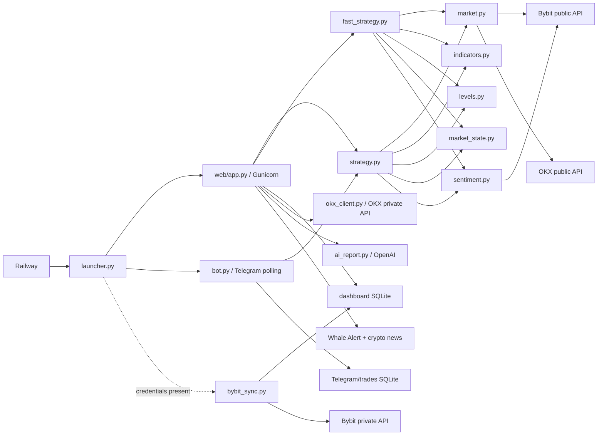

# BTC AI Terminal architecture

This document describes the current stable code at commit `64dc90c` on the
`develop` branch. It is an as-is map and a behavior-preserving refactoring
plan; it does not redefine trading rules.

## Runtime topology

Railway starts `launcher.py`, which supervises these processes:

1. Gunicorn serves `web/app.py` with one worker and four threads.
2. `bot.py` runs the Telegram polling bot.
3. `bybit_sync.py` runs only when the Bybit read-only credentials exist.

The web process and Telegram bot calculate signals independently. Their shared
state is persisted in SQLite, while exchange and public-market data are fetched
over HTTP.



## Real data flows

### Dashboard analysis

1. A request reaches `/` in `web/app.py` with exchange, symbol, and strategy.
2. The route normalizes those values and calls `_get_cached_strategy()`.
3. Swing dispatches to `strategy.analyze_strategy()`; Fast dispatches to
   `fast_strategy.analyze_fast_strategy()`.
4. The selected strategy fetches ticker/candles through `market.py`, calculates
   technical indicators, market state, support/resistance and trade levels, and
   fetches Bybit derivatives sentiment.
5. The strategy returns a dictionary used as the de facto result contract.
6. `web/app.py` saves a periodic snapshot through `dashboard_history.py`, loads
   history/trades/orders/account data, and renders `web/templates/index.html`.
7. Browser-side code in `web/static/js/dashboard.js` calls `/api/chart-data`,
   `/api/whale-alerts`, `/api/crypto-news`, and `/api/ai-report` as needed.

Important detail: choosing OKX changes public ticker/candles to OKX, but
`sentiment.py` still reads Bybit derivatives endpoints. This is current
behavior and must remain explicit during refactoring.

### AI report

1. `/api/ai-report` obtains the cached strategy result.
2. Whale and news context are fetched concurrently.
3. `ai_report.generate_report()` builds a Russian prompt from the deterministic
   strategy result plus that external context.
4. OpenAI produces explanatory text. It does not calculate or override the
   strategy decision.

`ai_report.py` validates `OPENAI_API_KEY` at import time. `web/app.py` imports it
inside the endpoint, so the dashboard can start without the key and only the AI
request fails.

The current `/api/ai-report` endpoint normalizes strategy and symbol but does
not read or forward the selected exchange. Its strategy lookup therefore uses
the default Bybit analysis even when the dashboard is displaying OKX. This is
existing behavior to preserve during refactoring and review separately as a
future product correction.

### Telegram analysis and automatic signals

1. `bot.py` initializes the Telegram SQLite schema and starts polling.
2. Manual analysis and the repeating auto-signal job call
   `strategy.analyze_strategy()` in a worker thread.
3. Results are formatted in `bot.py`; signal subscriptions and last-signal keys
   are persisted through `database.py`.
4. Telegram currently uses Swing only. It does not dispatch to Fast.
5. Telegram order/statistics views also import dashboard trade accessors from
   `web/dashboard_trades.py`, crossing the web boundary.

### Orders, trades, and exchange accounts

- `web/dashboard_trades.py` owns a large SQLite persistence layer, CSV import,
  pending-order lifecycle, order classification, FIFO statistics, sell advice,
  and Bybit synchronization mappings.
- `bybit_sync.py` polls the Bybit private API and writes executions/open orders
  through `web.dashboard_trades` functions.
- `okx_client.py` reads OKX account/private order data directly; `web/app.py`
  combines it with local trade calculations for display.
- `database.py` separately owns Telegram trades, imported Bybit executions,
  statistics, subscriptions, and signal deduplication.

## Module responsibilities and dependencies

| Module | Current responsibility | Direct project dependencies |
|---|---|---|
| `launcher.py` | Process supervision and persistent DB paths | web app, bot, optional sync (subprocesses) |
| `market.py` | Bybit/OKX public ticker and candle adapters plus normalization | `config.py` |
| `indicators.py` | RSI, EMA, MACD and ATR calculation | none |
| `levels.py` | Support/resistance and risk/target level calculation | none |
| `market_state.py` | UPTREND/RANGE/DOWNTREND classification | none |
| `sentiment.py` | Bybit funding, OI and long/short requests and scoring | `config.py` |
| `strategy.py` | Swing orchestration, scoring, grading, decision and result assembly | market, indicators, levels, market state, sentiment |
| `fast_strategy.py` | Fast orchestration, scoring, grading, decision and result assembly | same five modules as Swing |
| `web/app.py` | Auth, routing, input normalization, caches, orchestration, account/trade view composition, AI endpoint | strategy modules, market, OKX, history, trades, parsing, news, whales |
| `web/dashboard_history.py` | Snapshot persistence and strategy comparison | SQLite only |
| `web/dashboard_trades.py` | Trade/order persistence and substantial trading/account calculations | SQLite/files only |
| `bot.py` | Telegram UI, analysis orchestration, trading workflow, CSV import, auto-signals | strategy, market, OKX, database, dashboard trades |
| `database.py` | Telegram trade/execution/subscription persistence and FIFO statistics | SQLite only |
| `bybit_sync.py` | Bybit authentication/polling/mapping and sync orchestration | dashboard trades |
| `ai_report.py` | Prompt construction and OpenAI report generation | none of the strategy modules |
| `web/whale_alert.py` | Scrape/cache/interpret whale events | none |
| `web/crypto_news.py` | Download/cache/filter/score news | none |
| `web/order_parser.py` | OpenAI-based order extraction from text/image | none |

## Duplicated or mixed responsibilities

These are refactoring targets, not instructions to change behavior immediately.

### High priority

1. **Swing and Fast duplicate the strategy pipeline.** Both fetch market data,
   calculate indicators/state/levels, score trend/entry/RSI/MACD/sentiment,
   grade, apply target gating, and assemble nearly identical result dictionaries.
   Divergence is already visible in field defaults and timeframe semantics.
2. **`web/app.py` is both transport and application service.** It owns HTTP auth,
   normalization, two caches, strategy dispatch, history writes, parallel account
   loading, trade/order composition and AI orchestration.
3. **`web/dashboard_trades.py` mixes persistence and domain logic.** A single
   module handles schema/repair, CRUD, CSV parsing, exchange synchronization,
   classification, profit estimates, FIFO accounting and sell advice.
4. **There are two database boundaries for overlapping trade concerns.**
   `database.py` and `web/dashboard_trades.py` both implement trade/execution
   storage and FIFO/statistical calculations, with different consumers and
   environment variables.
5. **Telegram depends on a module inside `web/`.** `bot.py` and `bybit_sync.py`
   import `web.dashboard_trades`, so the web directory is not merely a delivery
   adapter and cannot be separated safely.

### Medium priority

6. **Exchange selection is spread across layers.** `market.py` branches between
   Bybit and OKX; `web/app.py` normalizes exchange and reads accounts; Telegram
   branches again; OKX symbol conversion is private to `market.py`; sentiment is
   always Bybit. There is no explicit exchange interface or capability model.
7. **The strategy result is an implicit dictionary contract.** Templates,
   Telegram formatting, history, order classification and AI prompts depend on
   string keys without one schema or contract test.
8. **Configuration is distributed and evaluated at different times.** Settings
   come from `config.py`, module-level environment reads, launcher-set variables,
   and import-time AI initialization.
9. **Formatting and presentation assumptions leak into domain results.** Strategy
   functions build display symbols, localized descriptions, reasons, warnings
   and decisions alongside numeric calculations.
10. **`app.py` is a second, older Flask entry point.** Production uses
    `web/app.py`; the root app duplicates basic dashboard/chart behavior and can
    mislead maintainers unless its legacy status is documented or later removed.

### Low priority / cleanup

11. `ai.py`, `report.py`, and `coinglass.py` appear empty or vestigial; their
    intended status is undocumented.
12. Tests live in the repository root and mix unit, integration and utility
    scripts. Some depend on live services or optional credentials.
13. The untracked file `how --stat 992cc51` and committed patch artifacts are
    operational debris; leave them untouched during this documentation sprint.

## Architectural risks to preserve and characterize

- A single strategy calculation performs several remote calls and has no
  transaction-like snapshot across ticker, candles and sentiment.
- Web caches are process-local. Gunicorn currently has one worker; increasing
  worker count changes cache and snapshot behavior.
- `_cache_lock` is held while remote strategy/candle work runs, serializing
  otherwise unrelated cache misses inside the web process.
- SQLite is shared by multiple processes. Any storage refactor must preserve
  paths, schema, locking behavior and existing data.
- Public OKX analysis plus Bybit sentiment is a hybrid signal. Treat it as an
  explicit existing rule, not an accidental fix during extraction.
- `detect_market_state()` receives 1D/4H for Swing but 4H/1H for Fast. Its
  parameter names are semantic only for Swing, although its calculations are
  generic.
- `web/app.py` relies on Gunicorn's `--chdir web` setting for sibling imports
  such as `dashboard_history`. Importing it as a normal `web.app` package from
  the repository root fails unless `web/` is added to `sys.path`.
- The UI, history and AI layers consume exact result keys and localized strings;
  a structurally cleaner return value can still be a breaking change.

## Behavior-preserving refactoring plan

Each phase ends with identical outputs for fixed inputs and a deployable system.
No scoring threshold, formula, timeframe, endpoint, DB schema, message, result
key or exchange fallback changes unless handled as a separate product change.

### Phase 0 — Freeze observable behavior

- Add contract tests for the complete Swing and Fast result dictionaries using
  fixed ticker/candle/sentiment fixtures.
- Add golden tests for grades, decisions, reasons/warnings, trade levels and
  Telegram formatting at threshold boundaries.
- Add Flask route tests for `/`, `/api/chart-data`, `/api/ai-report`, trade and
  order endpoints with external calls replaced by fixtures.
- Record existing SQLite schemas and test them against copies of real-shaped DBs.
- Classify tests as unit, integration or live/credentialed; keep live tests out of
  the default offline suite.

Exit criterion: the current commit passes a deterministic offline regression
suite and its result schema is documented.

### Phase 1 — Establish packages without moving behavior

- Introduce `core/`, `market/`, `strategy/`, `storage/`, `ai/`, `telegram/` and
  `web/` package boundaries gradually.
- First add compatibility modules/re-exports so existing imports keep working.
- Centralize constants and settings only after characterization tests cover
  their current values and environment-variable timing.
- Mark root `app.py` and empty/legacy modules explicitly; do not delete them yet.

Exit criterion: all old entry points and imports still work and runtime output is
unchanged.

### Phase 2 — Extract a market-data boundary

- Define a small public market-data interface for ticker and candles.
- Move current Bybit and OKX HTTP details into separate adapters.
- Preserve current symbol conversions, candle ordering, column types, timeframes,
  limits, timeouts and exceptions behind the interface.
- Model sentiment as a separate provider and explicitly retain Bybit sentiment
  for both selected exchanges.

Exit criterion: strategy tests pass unchanged against both adapters and the
hybrid OKX/Bybit-sentiment behavior remains visible.

### Phase 3 — Separate strategy orchestration from rules

- Create a shared analysis context containing ticker, frames, calculated
  indicators, support/resistance, sentiment and market state.
- Extract pure rule modules for trend, entry, indicators, grading and risk/target
  gating, one concern at a time.
- Keep separate Swing and Fast profiles for weights, thresholds and timeframes.
- Retain a compatibility serializer that emits the exact current dictionary.
- Make the top-level engine coordinate providers and pure rules; it must not
  silently merge or normalize differences between Swing and Fast.

Exit criterion: fixed inputs produce byte-for-byte-equivalent serializable
results and both existing top-level strategy functions remain callable.

### Phase 4 — Add an application-service layer

- Move strategy selection, normalization, cache access and snapshot scheduling
  out of Flask routes into an analysis service.
- Let both `web/app.py` and `bot.py` call that service while preserving Telegram's
  current Swing-only behavior.
- Keep cache TTLs (60 seconds for strategy, 15 seconds for candles) and current
  cache keys unchanged initially.
- Move AI-context orchestration behind a report service; keep deterministic
  strategy decisions separate from generated prose.

Exit criterion: Flask routes and Telegram handlers are thin adapters with
unchanged responses/messages.

### Phase 5 — Unify storage boundaries safely

Current status: completed through compatibility storage boundaries. Dashboard
history and trade/order persistence now live under `btc_terminal.storage`;
Telegram uses a storage facade over its unchanged root repository. The physical
database files remain separate and no data migration is part of this phase.

- Move persistence code out of `web/` into storage repositories without changing
  physical databases or schemas.
- Separate pure trade calculations (FIFO, profit, classification, sell advice)
  from SQLite access and CSV/exchange mapping.
- Adapt Telegram, dashboard and Bybit sync to repository interfaces one consumer
  at a time.
- Only after compatibility is proven, decide whether the two databases should
  remain separate or be migrated. A merge is not part of the refactor itself.

Exit criterion: existing database files work without migration and all consumers
return the same records/statistics.

### Phase 6 — Clean delivery adapters and legacy files

Current status: behavior-preserving cleanup completed. Strategy analysis, AI
report orchestration, trade calculations, storage, and Telegram formatting now
have explicit package boundaries. Deployment and legacy entry points are covered
by contracts. Physical relocation of test files is deferred as a separate
mechanical change; `run_offline_tests.py` already defines the safe logical suite.

- Reduce `web/app.py` to auth, request validation, service calls and response
  rendering.
- Move Telegram-specific formatting/workflows under `telegram/`.
- Confirm whether root `app.py`, `ai.py`, `report.py` and `coinglass.py` have any
  deployment or manual users; deprecate, then remove only in a separate change.
- Move tests into `tests/unit`, `tests/integration` and `tests/live` without
  changing what the default suite asserts.

Exit criterion: launcher behavior, Railway health check, dashboard, Telegram,
sync process and AI report all match the Phase 0 baselines.

## Target dependency direction

```text
web / telegram / sync (delivery adapters)
                 |
                 v
application services (analysis, reports, accounts, trades)
                 |
                 v
domain rules (strategy profiles, levels, grading, trade calculations)
                 ^
                 |
ports/interfaces (market data, sentiment, repositories, AI text)
                 ^
                 |
infrastructure adapters (Bybit, OKX, SQLite, OpenAI, external feeds)
```

Domain rules should not import Flask, Telegram, SQLite, HTTP clients or OpenAI.
Delivery adapters should not import persistence implementations directly.

## Definition of “behavior preserved”

For every phase, preservation means:

- identical Swing and Fast numeric outputs for the same input data;
- identical grade/decision and ordered reasons/warnings;
- identical result keys used by templates, history, Telegram and AI;
- unchanged routes, query/form fields, status codes and rendered workflows;
- unchanged Telegram commands, buttons, messages and auto-signal deduplication;
- unchanged SQLite paths/schemas and compatibility with existing data;
- unchanged Railway start command, health endpoint and conditional sync startup;
- unchanged exchange mappings, timeframes, cache TTLs and current fallback rules.

New product behavior (including Alpha, additional exchanges, different scoring,
or a database migration) should start only after these refactoring phases and be
reviewed separately.

## Post-refactor product extension: Alpha

Alpha was added after the behavior-preserving checkpoint as an isolated product
change. It is a conservative 1D + 4H pullback profile with staggered 20/30/50
limit entries, round-number buffers, a hard block against chasing sharp upward
momentum, a minimum 1.5% safe target requirement, and trailing protection that
activates only after TP1. Dashboard selection, analysis caching, history,
strategy comparison, chart data, AI reports, and order classification recognize
the `alpha` strategy key. Telegram remains Swing-only.

### Alpha Rescue

The training chapter "Your rescue circle" is implemented separately as a
read-only BTC↔ETH recovery calculator. It derives the live ETH/BTC cross rate
from the selected exchange, models both conversion fees, and calculates the
cross-price target required to return 1% more of the original base asset. It can
also compare projected value with the user's USD cost basis. It never places
orders and explicitly warns that increasing coin quantity does not guarantee
USD recovery.

## Legacy module audit

The deployment path is unambiguous: `railway.json` starts `launcher.py`, which
runs Gunicorn with `--chdir web app:app`, starts `bot.py`, and conditionally
starts `bybit_sync.py`. Therefore the root files below are not production entry
points:

| File | Current evidence | Safe disposition |
|---|---|---|
| root `app.py` | no runtime importer; Gunicorn resolves `web/app.py` after changing directory | keep as deprecated until a separate removal change |
| `ai.py` | empty and not imported | keep as deprecated placeholder; remove separately |
| `report.py` | empty and not imported | keep as deprecated placeholder; remove separately |
| `coinglass.py` | not imported by runtime; covered by a legacy module test | retain until its fixture API is explicitly retired |

No legacy file is removed during the behavior-preserving refactor. This avoids
breaking undocumented manual commands while making the supported launch path
explicit.
